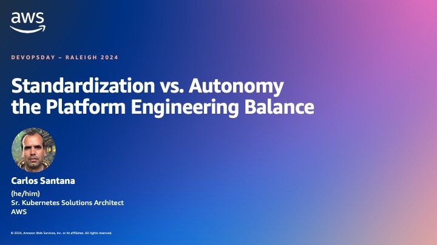

# Standardization vs. Autonomy the Platform Engineering Balance

Slides: [Standardization vs. Autonomy the Platform Engineering Balance](PlatformEngineering-DevOpsDayRaleigh.pdf)

[](PlatformEngineering-DevOpsDayRaleigh.pdf)

### Demo:
Have docker installed
```bash
export REPO_ROOT=$(git rev-parse --show-toplevel)
${REPO_ROOT}/hack/run-local.sh
```
#### Accessing UIs
- Argo CD: https://cnoe.localtest.me:8443/argocd
- Argo Workflows: https://cnoe.localtest.me:8443/argo-workflows
- Backstage: https://cnoe.localtest.me:8443/
- Gitea: https://cnoe.localtest.me:8443/gitea
- Keycloak: https://cnoe.localtest.me:8443/keycloak/admin/master/console/

### Access Passwords
```bash
# argoCD password. username is admin.
kubectl -n argocd get secret argocd-initial-admin-secret \
  -o go-template='{{ range $key, $value := .data }}{{ printf "%s: %s\n" $key ($value | base64decode) }}{{ end }}'

# gitea admin credentials
kubectl get secrets -n gitea gitea-admin-secret \
  -o go-template='{{ range $key, $value := .data }}{{ printf "%s: %s\n" $key ($value | base64decode) }}{{ end }}'

# access backstage and argo-workflow
kubectl -n keycloak get secret keycloak-config \
  -o go-template='{{ range $key, $value := .data }}{{ printf "%s: %s\n" $key ($value | base64decode) }}{{ end }}'
```
>WARNING: Do not expose this to the internet as the gitea password is generic please see https://github.com/cnoe-io/idpbuilder/issues/192

Add crossplane credentilas
```bash
export AWS_ACCESS_KEY_ID=<AWS_ACCESS_KEY_ID>
export AWS_SECRET_ACCESS_KEY=<AWS_SECRET_ACCESS_KEY>
export REPO_ROOT=$(git rev-parse --show-toplevel)
${REPO_ROOT}/hack/install-provider-secret.sh
```

### Resources
- https://cnoe.io/
- https://github.com/cnoe-io/idpbuilder
- https://github.com/gitops-bridge-dev
- [Enabling Scientists to Collaborate with Amazon EKS and Open Science Studio](https://aws.amazon.com/blogs/opensource/enabling-scientists-to-collaborate-with-amazon-eks-and-open-science-studio/)
